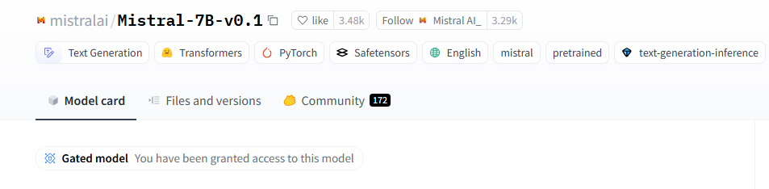
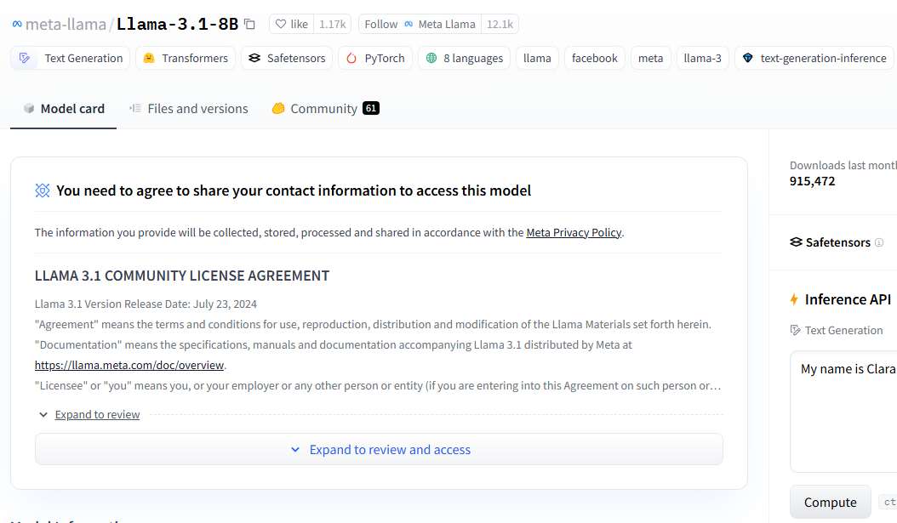
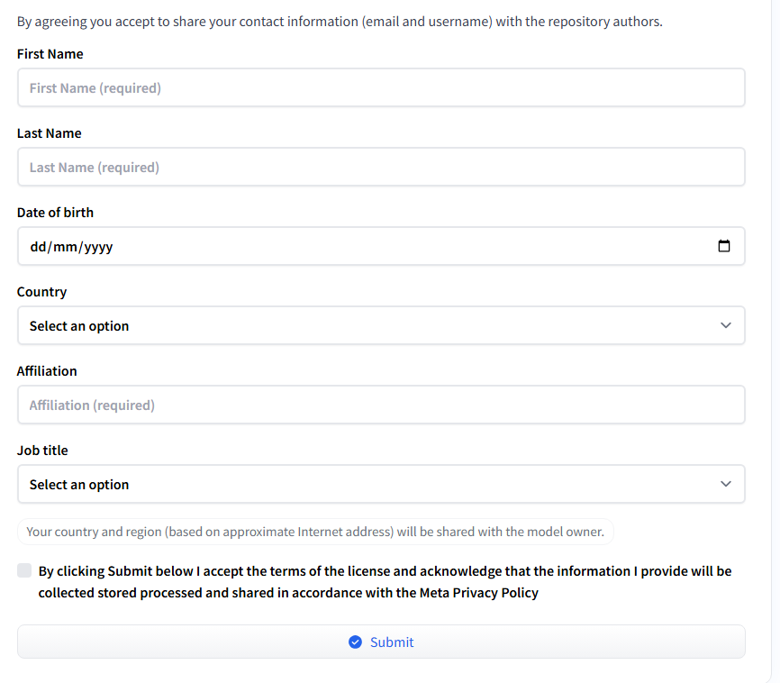
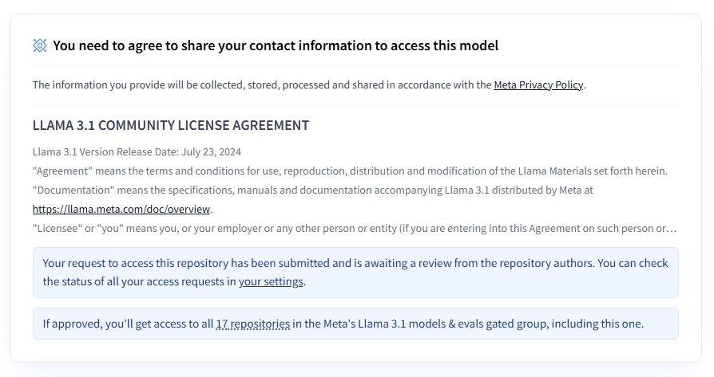
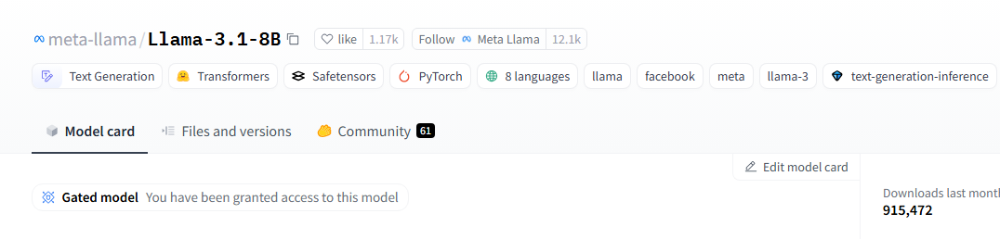
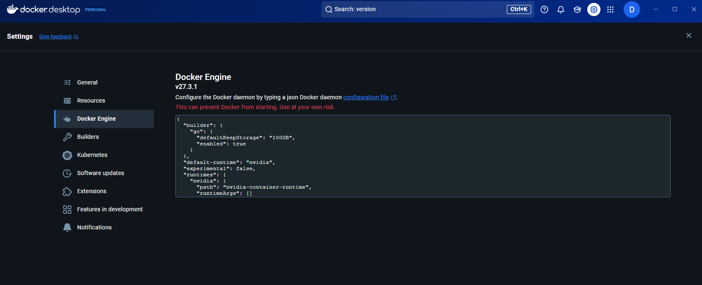
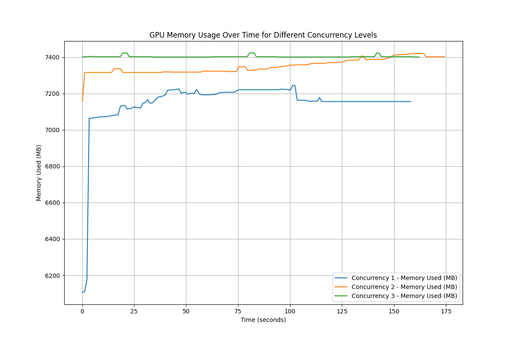
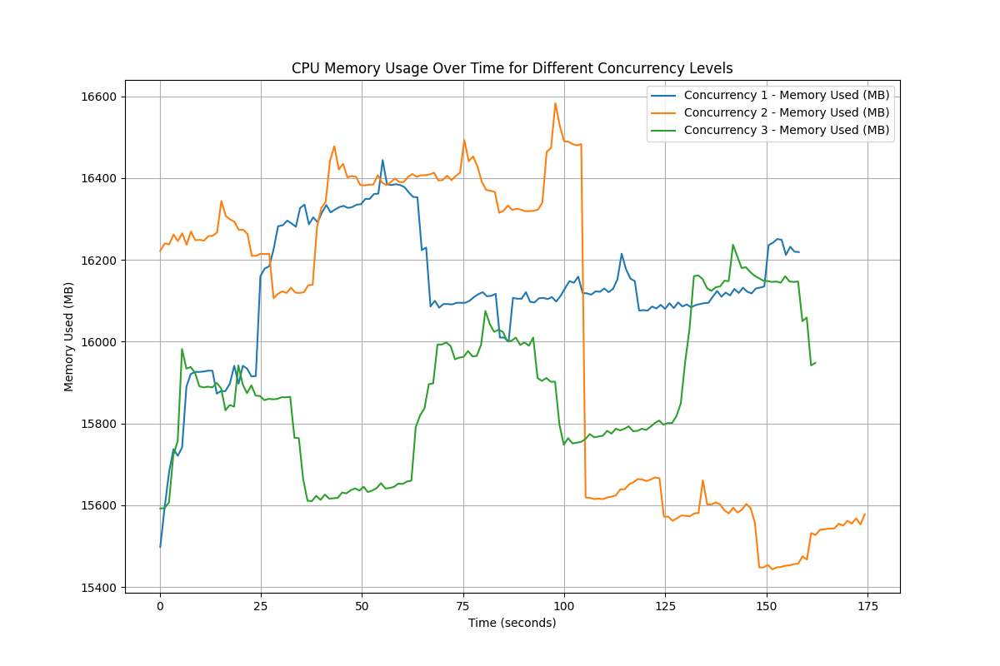
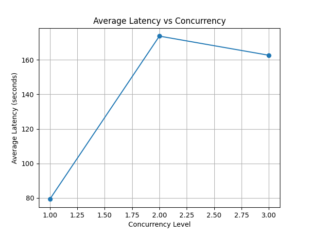
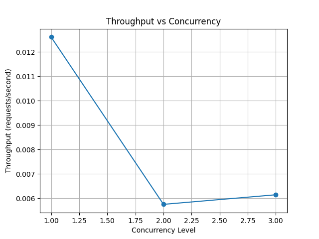

## Llama Based Chat App

# Instructions:

I have built the llama/mistral based chat app using the following resources:
* meta-llama/Llama-3.1-8B
* mistralai/Mistral-7B-v0.1
* huggingface
* FastAPI
* Docker

The needed python packages to run this project is mentioned in the requirements.txt file

### How to get access to the models:
In order to have the access to these gated models you need to log in to Huggingface first, in case you 
don't have an account already, you need to create one at [Huggingface](https://huggingface.co/join) and verify your email.

Next step is to get the access to the gated repositories:

#### mistralai/Mistral-7B-v0.1:
You need to [Agree and access repository of Mistral-7B-v0.1](https://huggingface.co/mistralai/Mistral-7B-v0.1).
The access is granted instantly once accepted. Once accepted you will get to see the following:




#### meta-llama/Llama-3.1-8B:
Getting access to [Meta-Llama 3.1 8B](https://huggingface.co/meta-llama/Llama-3.1-8B) is a bit time-consuming.
It took around 15 minutes for me. First you need to fill out a basic form with you name and date of birth. You can use Affiliation as your current country,
for me, it was Germany.

The process will look like the following:








Once granted you will receive an email as well, and you will get to see the following:



Once these steps are done and all accesses are granted, you can now create the API token for these.
Note: An API created before access granted will not work.

## =====================================

#### API Creation
Now you can create an api access token from here: [API_TOKEN](https://huggingface.co/settings/tokens)
The FineGrained API is better where you can add repositories even after getting access later but for me FineGrained 
API key didn't work, so I used the Write one: [Api token with write access](https://huggingface.co/settings/tokens/new?tokenType=write).
Once done, create an `.env` file to the root directory of this project add the following line:

`API_TOKEN = "YOUR_API_TOKEN"`

## =====================================

## Run the application using Docker:

First run your already installed docker client.
I recommend to update the docker if it is not updated, due to a bug in Docker Desktop 4.10.0,
I ran into a problem of torch not being able to use cuda. Therefore, I would strongly recommend to update the 
Docker Desktop to 4.36.0. In order to enable docker to use your GPU you need to add the following config in `daemon.json` file
```
{
  "builder": {
    "gc": {
      "defaultKeepStorage": "100GB",
      "enabled": true
    }
  },
  "default-runtime": "nvidia",
  "experimental": false,
  "runtimes": {
    "nvidia": {
      "path": "nvidia-container-runtime",
      "runtimeArgs": []
    }
  }
}

```
Alternatively, you can do this from Docker Desktop Application as well. Docker --> Settings --> Docker Engine



Once these steps are done, use the following command to build the docker image
```
docker build --no-cache -t fastapi-llama-service:latest .
```
I have used `pytorch/pytorch:2.5.1-cuda12.4-cudnn9-devel` as base image,
as this already have the necessary cuda drivers and compatible pytorch installed.

Once this is done use the following command to run:
```
docker run --gpus all -e API_TOKEN="YOUR_API_TOKEN" -p 8000:8000 -p 8501:8501 fastapi-llama-service:latest
```
When running for the first time it will take some time to download the shards. Once it is ready you will see

`INFO:     Application startup complete.`

use `http://localhost:8501/` to access the streamlit app.

If you want to test the app using curl use the following command
```
curl -X POST "http://localhost:8000/query" \
-H "Content-Type: application/json" \
-d "{\"queries\": [\"Explain Quantum Computing.\", \"What is an AI?"\]}"
```
Based one what you use (shell or cmd or powershell) the escape sequences may vary.
You can add multiple queries here `[\"Explain Quantum Computing.\", \"What is an AI?"\]` 
the application will handle multiple queries and request concurrently.

## =====================================

## Run the application locally without docker:
```
pip install -r requirements.txt
```
The requirements.txt doesn't contain the pytorch as the docker is already having it as default.
You can use the following link to install pytorch and associated dependencies.
The installation command may look like the following based on your system:
```
pip3 install torch torchvision torchaudio --index-url https://download.pytorch.org/whl/cu121
```
Once this is done you can run the app using the following command:

````
uvicorn src.api.main:app --host 0.0.0.0 --port 8000 --reload --http h11
````
For the first time it will take some time to download all the shards. As I am using BitsAndBytes 4 bit quantization,
it will use the 4 bit quantized version of any model. After the first time loading the quantized version of the models generally 
take around 10-15 seconds (sometimes 45 seconds for llama)

Once you see on the console that `INFO:     Application startup complete.` you are ready to test the app.
To check the endpoint health you can use `http://localhost:8000/health`, it should show 
```
{
  "status": "healthy"
}
```

For using it from a UI I have used Streamlit. Run the streamlit app as follows:

```
streamlit run .\src\frontend\frontend.py
```
Instead of using `http://0.0.0.0:8501` use `http://localhost:8501/`

If you want to test the app using curl use the following command
```
curl -X POST "http://localhost:8000/query" \
-H "Content-Type: application/json" \
-d "{\"queries\": [\"Explain Quantum Computing.\", \"What is an AI?"\]}"
```
Based one what you use (shell or cmd or powershell) the escape sequences may vary.
You can add multiple queries here `[\"Explain Quantum Computing.\", \"What is an AI?"\]` 
the application will handle multiple queries and request concurrently.


## =====================================

## Benchmarking
To run the benchmarking run the following command

```
python .\src\benchmarking\benchmarking.py --concurrency_levels 1 2 3 --num_requests 10 --prompts ["What is the capital of France?", "Explain quantum mechanics."] --url "http://localhost:8000/query"

```
`--concurrency_levels 1 2 3` specifies the number of simultaneous users
(or threads) that will make requests at the same time.

`--num_requests 10` specifies the total number of requests to be 
sent across all concurrent users.

`--prompts ["What is the capital of France?", "Explain quantum mechanics."]` represents a query queue, all these will run
in parallel.

`--url "http://localhost:8000/query"` represents the endpoint url.

The benchmarking script is completely independent (whether the app is running in docker or on your host os) 
and can be run from anywhere as long as the necessary packages are installed.

Benchmarking creates plots which look like the following:

<table>
  <tr>
    <td></td>
    <td></td>
  </tr>
  <tr>
    <td></td>
    <td></td>
  </tr>
</table>

